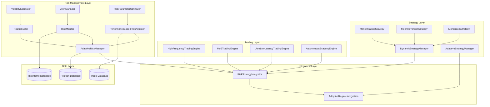
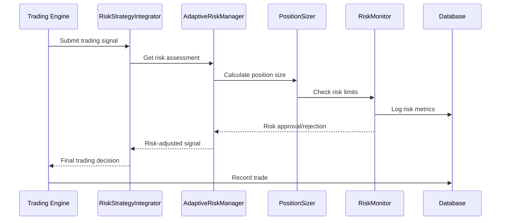
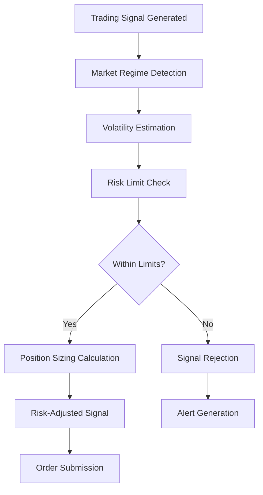
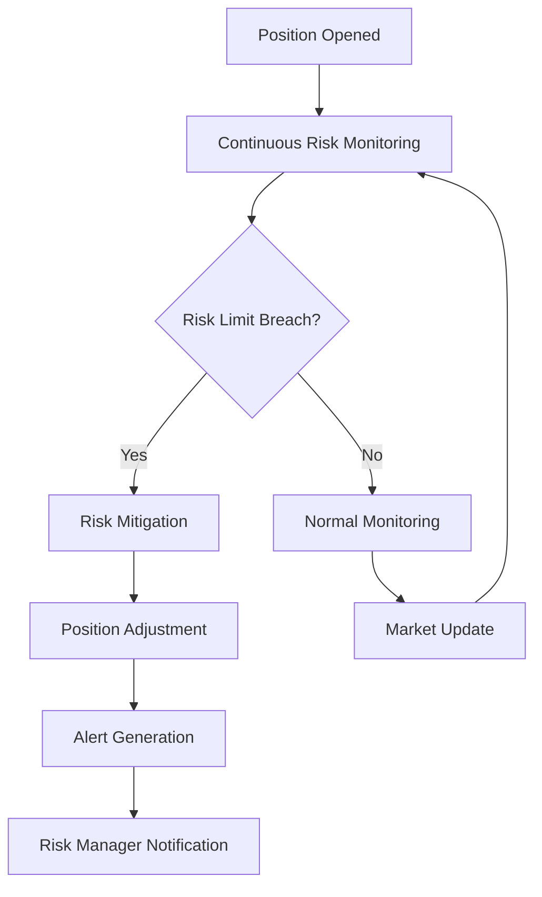
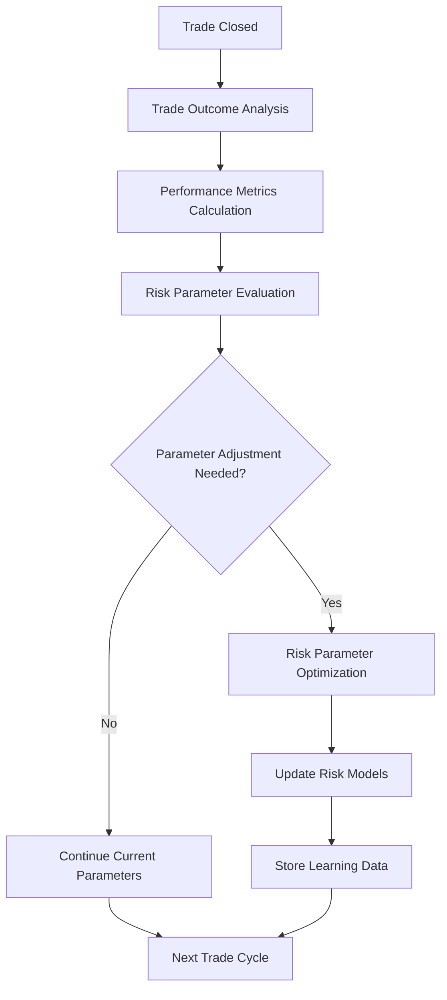

# Adaptive Risk Management System Integration Plan

## Executive Summary

This document outlines the integration strategy for the Adaptive Risk Management System with the existing CryptoScalp AI trading infrastructure. The adaptive risk management system provides dynamic position sizing, market regime detection, performance-based risk adjustment, and real-time risk monitoring capabilities that will enhance the existing trading systems.

## 1. System Architecture Overview

### 1.1 Current System Components

The existing codebase contains several key components that will integrate with the adaptive risk management system:

- **Trading Engines**: 
  - [`HighFrequencyTradingEngine`](src/trading/hft_engine.py:16) - Stub implementation for HFT operations
  - [`MoETradingEngine`](src/models/mixture_of_experts.py:381) - Mixture of Experts trading system
  - [`UltraLowLatencyTradingEngine`](src/trading/hft_engine/ultra_low_latency_engine.py:114) - Low-latency execution

- **Strategy Systems**:
  - [`DynamicStrategyManager`](src/learning/dynamic_strategy_switching.py:294) - Manages multiple trading strategies
  - [`AutonomousScalpingEngine`](src/learning/strategy_model_integration_engine.py:540) - Integrated strategy and ML system
  - [`AdaptiveStrategyManager`](src/core/adaptive_regime_integration.py:71) - Manages strategies for different market regimes

- **Data Models**:
  - [`Position`](src/database/models.py:69) - Database model for trading positions
  - [`RiskMetric`](src/database/models.py:88) - Database model for risk metrics
  - [`Trade`](src/database/models.py:39) - Database model for trade history

### 1.2 Adaptive Risk Management Components

The adaptive risk management system consists of several key modules:

- **Core Risk Management**:
  - [`AdaptiveRiskManager`](src/learning/adaptive_risk_management.py:378) - Main risk management coordinator
  - [`PositionSizer`](src/learning/adaptive_risk_management.py:221) - Dynamic position sizing based on risk
  - [`VolatilityEstimator`](src/learning/adaptive_risk_management.py:160) - Multiple volatility estimation methods

- **Risk Monitoring**:
  - [`RiskMonitor`](src/learning/risk_monitoring_alerting.py:259) - Real-time risk monitoring and alerting
  - [`AlertManager`](src/learning/risk_monitoring_alerting.py:191) - Manages risk alerts and notifications

- **Performance-Based Adjustment**:
  - [`PerformanceBasedRiskAdjuster`](src/learning/performance_based_risk_adjustment.py:194) - Adjusts risk parameters based on performance
  - [`RiskParameterOptimizer`](src/learning/performance_based_risk_adjustment.py:118) - Optimizes risk parameters

- **Integration Layer**:
  - [`RiskStrategyIntegrator`](src/learning/risk_strategy_integration.py:255) - Coordinates risk management with strategy switching

## 2. Integration Architecture

### 2.1 High-Level Architecture Diagram



### 2.2 Data Flow Diagram



## 3. Integration Points

### 3.1 Trading Engine Integration

The adaptive risk management system will integrate with trading engines through the [`RiskStrategyIntegrator`](src/learning/risk_strategy_integration.py:255) component:

1. **Order Submission Hook**:
   - Intercept all order submissions before execution
   - Apply risk-based position sizing and validation
   - Return risk-adjusted order parameters

2. **Position Monitoring**:
   - Real-time monitoring of position risk metrics
   - Automatic position adjustments based on risk limits
   - Stop-loss and take-profit management

3. **Performance Feedback**:
   - Trade outcome analysis for risk parameter optimization
   - Performance metrics collection for adaptive learning

### 3.2 Strategy System Integration

The risk management system will enhance strategy switching and selection:

1. **Strategy Risk Profiling**:
   - Assign risk profiles to each strategy type
   - Dynamic risk parameter adjustment based on market regime
   - Strategy performance-based risk allocation

2. **Market Regime Integration**:
   - Coordinate with [`AdaptiveRegimeIntegration`](src/core/adaptive_regime_integration.py:291) for regime-aware risk management
   - Adjust risk parameters based on detected market conditions
   - Regime-specific risk limits and position sizing

3. **Strategy Selection**:
   - Risk-aware strategy selection and switching
   - Portfolio-level risk optimization across multiple strategies
   - Dynamic capital allocation based on strategy risk

### 3.3 Database Integration

The system will extend the existing database schema:

1. **Risk Metrics Storage**:
   - Extend [`RiskMetric`](src/database/models.py:88) model with adaptive risk parameters
   - Store historical risk adjustments and their outcomes
   - Track risk limit breaches and mitigations

2. **Position Management**:
   - Enhance [`Position`](src/database/models.py:69) model with risk metadata
   - Store risk-adjusted stop-loss and take-profit levels
   - Track position risk metrics over time

3. **Performance Analytics**:
   - Integrate with [`PerformanceAnalytic`](src/database/models.py:149) for risk-adjusted performance metrics
   - Store risk-adjusted returns and Sharpe ratios
   - Track risk-based performance attribution

## 4. Implementation Strategy

### 4.1 Phase 1: Core Integration

1. **Risk-Strategy Integration**:
   - Implement the [`RiskStrategyIntegrator`](src/learning/risk_strategy_integration.py:255) as the central coordination point
   - Create interfaces between trading engines and risk management
   - Implement basic position sizing and risk validation

2. **Database Extensions**:
   - Extend existing database models to support adaptive risk parameters
   - Create migration scripts for schema updates
   - Implement risk metrics storage and retrieval

3. **Basic Risk Monitoring**:
   - Implement real-time risk monitoring with existing trading engines
   - Set up basic risk alerts and notifications
   - Create risk dashboard for monitoring

### 4.2 Phase 2: Advanced Features

1. **Performance-Based Adjustment**:
   - Implement trade outcome analysis and learning
   - Create risk parameter optimization algorithms
   - Integrate with existing performance analytics

2. **Market Regime Integration**:
   - Connect with [`AdaptiveRegimeIntegration`](src/core/adaptive_regime_integration.py:291) for regime-aware risk management
   - Implement regime-specific risk parameters
   - Create dynamic risk adjustment based on market conditions

3. **Advanced Position Sizing**:
   - Implement sophisticated position sizing algorithms
   - Add portfolio-level risk optimization
   - Create multi-asset position sizing strategies

### 4.3 Phase 3: Optimization and Testing

1. **Performance Optimization**:
   - Optimize risk calculation algorithms for low-latency trading
   - Implement caching for frequently used risk metrics
   - Optimize database queries for risk data

2. **Comprehensive Testing**:
   - Create test scenarios for different market conditions
   - Implement backtesting for risk management strategies
   - Perform stress testing for extreme market events

3. **Deployment and Monitoring**:
   - Deploy integrated system to production environment
   - Set up comprehensive monitoring and alerting
   - Create rollback procedures for risk management failures

## 5. Risk Management Workflow

### 5.1 Pre-Trade Risk Assessment



### 5.2 Real-Time Risk Monitoring



### 5.3 Post-Trade Analysis



## 6. Configuration and Parameters

### 6.1 Risk Limits Configuration

```yaml
risk_limits:
  max_portfolio_risk: 0.02  # 2% maximum portfolio risk
  max_position_risk: 0.01   # 1% maximum single position risk
  max_correlation_risk: 0.05 # 5% maximum correlated positions risk
  max_drawdown: 0.10        # 10% maximum drawdown
  var_95: 0.02             # 95% Value at Risk
  expected_shortfall: 0.03 # Expected Shortfall
```

### 6.2 Position Sizing Parameters

```yaml
position_sizing:
  base_size: 0.01          # Base position size (1%)
  volatility_multiplier: 1.0 # Volatility adjustment factor
  confidence_threshold: 0.7  # Minimum confidence for position sizing
  max_leverage: 3.0        # Maximum leverage
  risk_per_trade: 0.005    # Risk per trade (0.5%)
```

### 6.3 Market Regime Parameters

```yaml
market_regimes:
  normal:
    risk_multiplier: 1.0
    position_size_multiplier: 1.0
    confidence_threshold: 0.7
  volatile:
    risk_multiplier: 1.5
    position_size_multiplier: 0.7
    confidence_threshold: 0.8
  trending:
    risk_multiplier: 0.8
    position_size_multiplier: 1.2
    confidence_threshold: 0.65
  crash:
    risk_multiplier: 2.0
    position_size_multiplier: 0.3
    confidence_threshold: 0.9
```

## 7. Testing and Validation

### 7.1 Unit Testing

- Test individual risk management components
- Validate position sizing calculations
- Verify risk limit enforcement
- Test alert generation and notification

### 7.2 Integration Testing

- Test integration with trading engines
- Validate strategy-risk coordination
- Test database operations and data consistency
- Verify end-to-end trading workflows

### 7.3 Performance Testing

- Measure latency impact of risk management
- Test system throughput under high load
- Validate memory usage and resource consumption
- Test system stability during extended operation

### 7.4 Backtesting

- Historical performance analysis of risk management strategies
- Comparison of risk-adjusted returns with and without adaptive risk management
- Validation of risk parameter optimization algorithms
- Stress testing with historical market crises

## 8. Monitoring and Alerting

### 8.1 Risk Metrics Dashboard

- Real-time portfolio risk metrics
- Position-level risk exposure
- Risk limit utilization
- Performance metrics and attribution

### 8.2 Alert Types

- Risk limit breach alerts
- Unusual volatility alerts
- System performance alerts
- Model degradation alerts

### 8.3 Reporting

- Daily risk reports
- Weekly performance summaries
- Monthly risk analytics
- Ad-hoc risk analysis reports

## 9. Deployment Strategy

### 9.1 Staged Deployment

1. **Development Environment**:
   - Complete implementation and testing
   - Performance optimization
   - Documentation completion

2. **Staging Environment**:
   - Integration with production-like systems
   - Load testing and validation
   - User acceptance testing

3. **Production Deployment**:
   - Gradual rollout with monitoring
   - A/B testing against existing systems
   - Full deployment after validation

### 9.2 Rollback Plan

- Immediate rollback procedures
- Data consistency checks
- System state restoration
- Communication protocols

## 10. Success Metrics

### 10.1 Risk Management Metrics

- Risk-adjusted returns improvement
- Maximum drawdown reduction
- Risk limit breach frequency
- Alert accuracy and timeliness

### 10.2 Performance Metrics

- System latency impact
- Throughput capacity
- Resource utilization
- Stability and uptime

### 10.3 Business Metrics

- Overall portfolio performance
- Trading strategy effectiveness
- Risk management cost-benefit ratio
- User satisfaction and adoption

## 11. Conclusion

The integration of the Adaptive Risk Management System with the existing CryptoScalp AI infrastructure will provide significant benefits through dynamic risk assessment, real-time monitoring, and performance-based optimization. The phased implementation approach ensures minimal disruption to existing operations while gradually introducing advanced risk management capabilities.

The integration leverages existing components and extends them with adaptive risk management features, creating a comprehensive trading system that balances performance with risk control. The modular architecture allows for future enhancements and customization based on evolving trading requirements and market conditions.