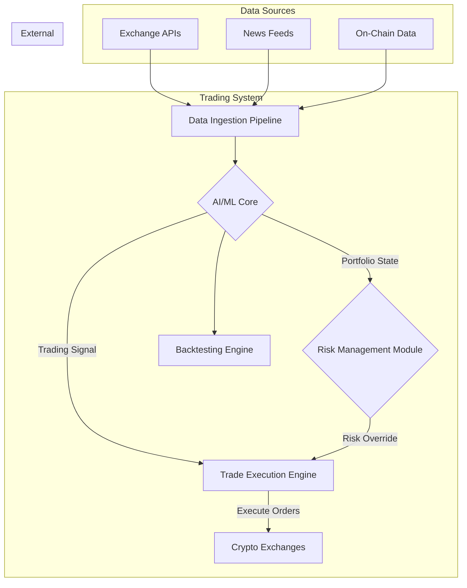

# Technical Overview

This document provides a high-level, accessible summary of the autonomous trading bot's technical architecture. The system is designed for scalability, security, and performance, leveraging a modular, microservices-based approach.

## Core Architectural Pillars

1.  **Data Ingestion & Processing Pipeline:**
    *   **Function:** Collects and normalizes massive volumes of data in real-time from multiple sources (exchange APIs, news feeds, on-chain data).
    *   **Technology:** Utilizes a high-throughput message queue (like Apache Kafka) and a stream processing engine (like Apache Flink) to ensure data is processed with minimal latency.

2.  **The AI/ML Core (The "Brain")**
    *   **Function:** This is the heart of the system. It analyzes the processed data to identify market patterns, predict price movements, and generate trading signals. It is composed of two key neural network types:
        *   **Predictive Networks (LSTMs):** These networks excel at understanding time-series data, allowing them to forecast potential market trends.
        *   **Reinforcement Learning (DQN/PPO):** The system learns optimal trading strategies through a process of trial-and-error in a simulated environment, much like a human learns from experience. It is rewarded for profitable actions and penalized for losses, allowing it to discover strategies that may not be obvious to human traders.

3.  **AI-Powered Risk Management Module:**
    *   **Function:** Acts as an autonomous supervisor to the AI Core. It continuously monitors the portfolio's overall risk exposure using metrics like Value at Risk (VaR). If risk exceeds a predefined threshold, this module can override the AI Core, reducing position sizes or hedging the portfolio to prevent significant drawdowns.
    *   **Analogy:** If the AI Core is the driver, the Risk Management Module is the advanced collision avoidance system that automatically applies the brakes when danger is detected.

4.  **Trade Execution & Smart Order Routing (SOR) Engine:**
    *   **Function:** Receives trading signals from the AI Core and executes them across multiple exchanges in the most efficient way possible. The SOR finds the best available price and aims to minimize transaction costs and market impact (slippage).

5.  **Hyper-Realistic Backtesting Environment:**
    *   **Function:** A simulation engine that allows us to test new AI models on historical data with extreme accuracy. It models exchange-specific details like fees, order book depth, and latency. This ensures that if a strategy performs well in the backtest, it has a high probability of performing well in the live market.

## System Diagram

## Security & Compliance
*   **Infrastructure:** Deployed on a secure, cloud-native infrastructure (e.g., AWS, GCP) with industry-standard security protocols.
*   **API Keys:** All exchange API keys are encrypted and stored in a secure vault (e.g., HashiCorp Vault) with restricted access.
*   **Auditable:** The system maintains immutable logs of all actions for security auditing and regulatory compliance.
